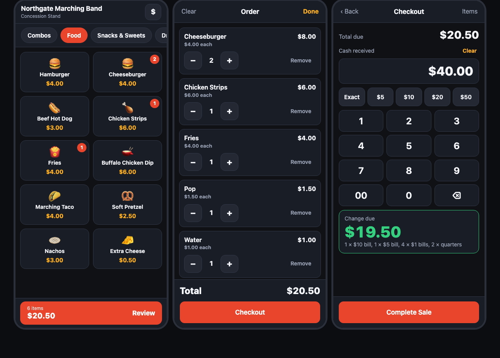

# Concession Menu

A tap-to-order register for a school concession stand, sized for the phone in
your pocket. Tap what the customer wants, hit **Review**, punch in the cash they
handed you, and it tells you the change — down to which bills and coins to count
back.

It's a folder of static files. No build step, no server, no accounts, no monthly
fee. Host it free on GitHub Pages, add it to your iPhone home screen, and it runs
full-screen and offline in the stand.



## What it does

- **Visual ordering.** Big picture buttons grouped into tabs. Each tile shows a
  running badge of how many are in the current order.
- **Change made obvious.** Enter the cash, get the change in huge green type plus
  a plain-English breakdown — *1 × $10 bill, 1 × $5 bill, 4 × $1 bills, 2 × quarters*.
- **Bills that stack.** Tap `$20` twice for two twenties. **Exact** fills in the
  total; **Clear** starts over.
- **Won't let you undercharge.** *Complete Sale* stays locked until the cash
  covers the total; hand over too little and the box turns red with the amount
  still owed.
- **Odd-priced items.** Candy is priced "as marked", so tapping it opens a keypad
  to type that item's price.
- **Optional choices.** An item can ask a follow-up question — Italian Ice asks
  the flavor — and the answer prints on the order line.
- **End-of-night totals.** The **$** button shows orders taken, cash in, and a
  count of every item sold.
- **Works with no signal.** The whole app caches on the phone the first time it
  opens.
- **All prices live in one JSON file** that anyone can edit without touching code.

## Put it on GitHub Pages

The repo already exists at `github.com/jasonmosley/concession-menu`. From this
folder:

```sh
rm -rf concession-menu        # an empty clone landed in here; the project itself is the repo
git init
git add .
git commit -m "Concession menu POS"
git branch -M main
git remote add origin https://github.com/jasonmosley/concession-menu.git
git push -u origin main
```

Then in the repo: **Settings → Pages → Source: Deploy from a branch → `main` /
`/ (root)` → Save.**

A minute later it's live at <https://jasonmosley.github.io/concession-menu/>, and
every `git push` redeploys it. Nothing uses absolute paths, so the repo can be
renamed and the sub-folder URL still works.

## Install it on your iPhone

1. Open the Pages URL in **Safari** — only Safari can install a web app on iOS.
2. Share button → **Add to Home Screen** → Add.

It now opens full-screen with no browser bars and runs with no signal. Do this
once at home before the game rather than in the stand with a crowd waiting.

Android/Chrome works the same way via **Install app** in the menu.

## Working the window

| Step | What you do |
|------|-------------|
| Order | Tap items. The tab strip switches categories; the badge on each tile is the count so far. |
| Fix a mistake | Tap the red bar → **Review** → `−` / `+` / **Remove** on any line. **Clear** dumps the whole order. |
| Checkout | **Checkout** → tap a bill button for each bill handed to you, or type the amount on the keypad. |
| Change | Read the green number, count it back using the breakdown underneath. |
| Finish | **Complete Sale** clears the order and returns to the grid, ready for the next customer. |

Typing a digit on the keypad after using the bill buttons starts a fresh amount,
so you never accidentally append to a bill total.

## Editing the menu

Everything on screen comes from `menu.json`. Edit it, commit, push — the app
picks up the change the next time it opens with a signal. No code involved.

```json
{ "id": "nachos", "name": "Nachos", "price": 3, "emoji": "🫓" }
```

| Field | Meaning |
|-------|---------|
| `id` | Unique short name. Used for the sales counts — keep it stable. |
| `name` | What shows on the button. |
| `price` | Dollars. `2.5` means $2.50. |
| `emoji` | The picture on the button. Optional. |
| `note` | Small gray line under the price. Optional. |
| `options` | Follow-up choices, asked before the item is added. Optional — only Italian Ice uses it. Delete the line to make an item a single tap. |
| `openPrice` | `true` means "ask me for the price", for anything priced as marked. |

Options can carry their own price when the choices differ:

```json
"options": [{ "name": "Large", "price": 4 }, { "name": "Small", "price": 2 }]
```

Top-level settings:

| Field | Meaning |
|-------|---------|
| `standName` / `subtitle` | The header text. |
| `taxRate` | `0` for none. `0.07` would add 7% and show a subtotal line. |
| `quickCash` | The bill buttons at checkout. Each tap **adds** that amount, so list the notes you actually get handed. |
| `categories` | The tabs, in file order. |

Keep each category to about ten items so it fills one phone screen without
scrolling.

After editing, check you didn't break the JSON before pushing:

```sh
python3 -c "import json; json.load(open('menu.json')); print('ok')"
```

## Offline, and how updates reach the phone

`sw.js` caches the app on first load, which is what makes it work with no bars of
service — and also means an old copy can linger:

- **`menu.json` and the page itself** are fetched fresh whenever there's a
  signal, so price changes appear on the next open.
- **The code** (`app.js`, `styles.css`) updates one launch behind — open it twice
  after a push.
- To force every device to drop its cached copy immediately, bump the version in
  `sw.js`: `var CACHE = 'concession-v1';` → `'concession-v2'`.

## Sales totals

Every completed sale is saved **on that phone**, in browser storage. The **$**
button shows the order count, cash taken in, and how many of each item sold —
enough to count down the drawer at the end of the night. **Reset totals** clears
it before the next game.

Nothing is synced anywhere, so:

- Run every order through the same phone if you want one combined number.
- Write the total down *before* you reset it.
- Two people working two phones will have two separate sets of numbers.

## Running it on a computer

```sh
./serve.command          # or: python3 -m http.server 8000
```

Open <http://localhost:8000>. On a tablet or laptop the layout widens into a
two-pane register with the order list docked on the right.

To use a laptop as the register and a phone as a second terminal on the same
Wi-Fi, find the machine's address with `ipconfig getifaddr en0` and open
`http://THAT-IP:8000` on the phone.

Opening `index.html` by double-clicking mostly works, but browsers block
`menu.json` on `file://` URLs; the app falls back to a file picker if that
happens. Serving the folder is the smoother path.

## Project structure

```
index.html      screens and layout
styles.css      phone-first styling, touch-sized targets
app.js          order logic, change calculation, sales log
menu.json       items and prices — the only file you need to edit
sw.js           offline cache
manifest.json   home screen name, colors, icons
icon-*.png      app icons (generated, safe to replace)
serve.command   double-click to run it locally on a Mac
docs/           README screenshots
```

## Notes

- Money is handled in whole cents throughout, so no rounding drift.
- The interface is dark on purpose: easier to read at a night game and it keeps
  the phone's status bar consistent in full-screen mode.
- There's no card processing, cash drawer, or receipt printer — it's a
  calculator with buttons, meant to replace a cash box and mental math.
